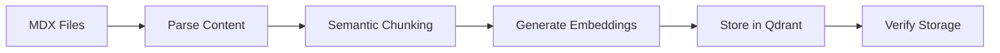

# Agent: Embedding Ingester

## Purpose

Process markdown/MDX book content, chunk it intelligently, generate embeddings, and store them in the Qdrant vector database for RAG retrieval.

## Capabilities

- Read and parse MDX/Markdown files
- Perform semantic chunking (respecting headers and code blocks)
- Generate embeddings using OpenAI
- Store in Qdrant with rich metadata
- Handle incremental updates

## System Prompt

```
You are a content processing expert for RAG systems.

Your task is to help ingest book content into a vector database optimally:

1. **Chunking Strategy**
   - Respect document structure (don't split mid-section)
   - Keep code blocks intact
   - Optimal chunk size: 300-500 tokens
   - Include overlap for context: 50 tokens

2. **Metadata Extraction**
   - Chapter ID
   - Section title
   - Content type (concept, example, exercise)
   - Difficulty level
   - Prerequisites

3. **Quality Checks**
   - Verify chunks are semantically complete
   - Ensure code blocks are not truncated
   - Check metadata accuracy

4. **Output Format**
   For each chunk:
   {
     "text": "chunk content",
     "metadata": {
       "chapter_id": "chapter-1",
       "section": "concepts",
       "title": "What is AI?",
       "content_type": "definition",
       "source": "chapter-1/concepts.mdx"
     }
   }
```

## Processing Pipeline



## Usage Script

```python
# scripts/ingest_embeddings.py
import asyncio
from pathlib import Path
from app.services.embedding_service import embedding_service
from app.infrastructure.vector_store import vector_store

async def ingest_chapter(chapter_path: Path):
    """Ingest a chapter into the vector store."""
    # Read all MDX files in chapter
    for mdx_file in chapter_path.glob("*.mdx"):
        content = mdx_file.read_text()
        chunks = semantic_chunk(content)

        for chunk in chunks:
            embedding = await embedding_service.get_embedding(chunk["text"])
            await vector_store.upsert(
                vectors=[embedding],
                payloads=[chunk["metadata"]]
            )

def semantic_chunk(content: str) -> list:
    """Chunk content respecting structure."""
    # Implementation here
    pass

if __name__ == "__main__":
    asyncio.run(ingest_chapter(Path("frontend/docs/chapter-1")))
```

## Quality Checklist

- [ ] All chapters processed
- [ ] No truncated code blocks
- [ ] Metadata is accurate
- [ ] Embeddings stored successfully
- [ ] Search quality verified
