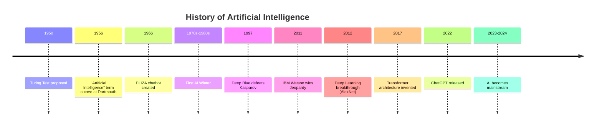

import Tabs from '@theme/Tabs';
import TabItem from '@theme/TabItem';

# Core Concepts of Artificial Intelligence

## What is Artificial Intelligence?

**Artificial Intelligence (AI)** is the field of computer science dedicated to creating systems that can perform tasks that typically require human intelligence.

:::note Definition
AI is the simulation of human intelligence processes by machines, especially computer systems. These processes include learning (acquiring information and rules), reasoning (using rules to reach conclusions), and self-correction.
:::

### Key Characteristics of AI Systems

| Characteristic | Description | Example |
|---------------|-------------|---------|
| **Learning** | Ability to improve from experience | A spam filter getting better at detecting spam |
| **Reasoning** | Drawing conclusions from information | A chess AI planning moves ahead |
| **Problem Solving** | Finding solutions to complex problems | Route optimization in GPS |
| **Perception** | Understanding the environment | Image recognition in self-driving cars |
| **Language Understanding** | Processing and generating human language | ChatGPT, virtual assistants |

## The AI Hierarchy: AI vs ML vs Deep Learning

Understanding the relationship between AI, Machine Learning, and Deep Learning is fundamental:

```
┌─────────────────────────────────────────────────────────┐
│                  ARTIFICIAL INTELLIGENCE                │
│      (The broadest concept - machines mimicking         │
│                 human intelligence)                     │
│                                                         │
│    ┌───────────────────────────────────────────────┐   │
│    │            MACHINE LEARNING                    │   │
│    │    (Subset of AI - learning from data          │   │
│    │         without explicit programming)          │   │
│    │                                                │   │
│    │    ┌───────────────────────────────────┐      │   │
│    │    │         DEEP LEARNING              │      │   │
│    │    │  (Subset of ML using neural        │      │   │
│    │    │   networks with multiple layers)   │      │   │
│    │    └───────────────────────────────────┘      │   │
│    │                                                │   │
│    └───────────────────────────────────────────────┘   │
│                                                         │
└─────────────────────────────────────────────────────────┘
```

<Tabs>
  <TabItem value="ai" label="🤖 AI" default>
    **Artificial Intelligence** encompasses any technique that enables computers to mimic human behavior.

    - Rule-based systems
    - Expert systems
    - Machine learning
    - Natural language processing
    - Computer vision

    **Example**: A chess program using hardcoded rules
  </TabItem>
  <TabItem value="ml" label="📊 Machine Learning">
    **Machine Learning** is a subset of AI that learns patterns from data without being explicitly programmed.

    - Supervised learning
    - Unsupervised learning
    - Reinforcement learning

    **Example**: A spam filter that learns from examples
  </TabItem>
  <TabItem value="dl" label="🧠 Deep Learning">
    **Deep Learning** uses neural networks with many layers to learn complex patterns.

    - Convolutional Neural Networks (CNNs)
    - Recurrent Neural Networks (RNNs)
    - Transformers

    **Example**: GPT models understanding and generating text
  </TabItem>
</Tabs>

## Types of AI

AI systems are categorized based on their capabilities:

### 1. Narrow AI (Weak AI)

**Current State**: This is what we have today.

Narrow AI is designed for specific tasks and excels at those tasks but cannot generalize beyond them.

```python
# Example: A narrow AI for sentiment analysis
def analyze_sentiment(text):
    """
    This AI can only analyze sentiment.
    It cannot play chess, recognize faces, or do anything else.
    """
    # Model trained specifically for this task
    return model.predict(text)  # Returns: "positive", "negative", or "neutral"
```

**Examples of Narrow AI:**
- Voice assistants (Siri, Alexa)
- Recommendation systems (Netflix, Spotify)
- Image recognition systems
- Language translation tools
- ChatGPT (optimized for conversation)

### 2. General AI (Strong AI)

**Future Goal**: Does not exist yet.

General AI would have human-level intelligence and could:
- Learn any intellectual task a human can
- Transfer knowledge between domains
- Understand context and nuance like humans

:::caution
General AI remains theoretical. Current "AGI" claims are largely marketing.
:::

### 3. Superintelligent AI

**Hypothetical**: Far future, if ever.

AI that surpasses human intelligence in all domains - creativity, problem-solving, and social intelligence.

## History of AI

### Timeline of Key Events



### The AI Winters

AI has experienced periods of reduced funding and interest:

| Period | Cause | Lesson |
|--------|-------|--------|
| 1974-1980 | Overpromised results, limited computing | Don't overhype capabilities |
| 1987-1993 | Expert systems failed to scale | Need better learning approaches |

### The Modern Renaissance (2012-Present)

The current AI boom is driven by:

1. **Big Data**: Massive datasets available for training
2. **Computing Power**: GPUs enabling parallel processing
3. **Algorithmic Advances**: Deep learning breakthroughs
4. **Investment**: Billions flowing into AI research

## Core Components of AI Systems

Every AI system consists of these fundamental components:

```
┌─────────────────────────────────────────────────────────┐
│                    AI SYSTEM ARCHITECTURE               │
├─────────────────────────────────────────────────────────┤
│                                                         │
│   ┌─────────┐    ┌─────────────┐    ┌─────────────┐   │
│   │  DATA   │───▶│   MODEL     │───▶│   OUTPUT    │   │
│   │ (Input) │    │ (Algorithm) │    │ (Prediction)│   │
│   └─────────┘    └─────────────┘    └─────────────┘   │
│       │                │                   │           │
│       ▼                ▼                   ▼           │
│  ┌─────────┐    ┌─────────────┐    ┌─────────────┐   │
│  │Preprocess│    │  Training   │    │ Evaluation  │   │
│  │ & Clean  │    │   Loop      │    │ & Feedback  │   │
│  └─────────┘    └─────────────┘    └─────────────┘   │
│                                                         │
└─────────────────────────────────────────────────────────┘
```

### 1. Data

The fuel for AI systems:

```python
# Types of data used in AI
data_types = {
    "structured": "Tables, databases (CSV, SQL)",
    "unstructured": "Text, images, audio, video",
    "semi_structured": "JSON, XML, logs"
}
```

### 2. Algorithms/Models

The brain of the AI:

- **Traditional ML**: Decision trees, SVM, Random Forest
- **Deep Learning**: Neural networks with multiple layers
- **Transformers**: Attention-based models (GPT, BERT)

### 3. Training Process

How AI learns:

```python
# Simplified training loop
for epoch in range(num_epochs):
    for batch in training_data:
        # Forward pass
        predictions = model(batch.inputs)

        # Calculate loss
        loss = loss_function(predictions, batch.labels)

        # Backward pass (learning)
        loss.backward()

        # Update model weights
        optimizer.step()
```

### 4. Inference

Using the trained model:

```python
# Inference - using the trained model
def get_prediction(user_input):
    processed_input = preprocess(user_input)
    prediction = trained_model.predict(processed_input)
    return postprocess(prediction)
```

## Key Takeaways

:::tip Remember
1. **AI** is the broad field of creating intelligent machines
2. **Machine Learning** is AI that learns from data
3. **Deep Learning** uses neural networks for complex patterns
4. Current AI is **Narrow AI** - specialized for specific tasks
5. **Data quality** is as important as algorithm choice
:::

---

Ready to see these concepts in action? Head to [Examples](/book/chapter-1/examples).
