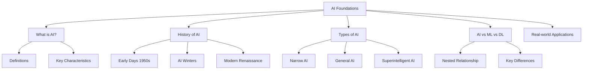

import ChapterActions from '@site/src/components/ChapterActions';

# Chapter 1: AI Foundations

<ChapterActions chapterId="chapter-1" />

## Learning Objectives

By the end of this chapter, you will be able to:

:::info Objectives
1. **Define** Artificial Intelligence and distinguish between different types of AI
2. **Explain** the historical evolution of AI from its inception to modern deep learning
3. **Identify** the key components that make up an AI system
4. **Understand** the relationship between AI, Machine Learning, and Deep Learning
5. **Recognize** real-world applications of AI across various industries
:::

## Why This Chapter Matters

Before diving into building AI applications, it's crucial to understand what AI actually is and how it works at a fundamental level. This foundational knowledge will:

- Help you make informed decisions about which AI techniques to use
- Enable you to communicate effectively about AI with stakeholders
- Provide context for the more advanced topics we'll cover later

## Chapter Overview

## Prerequisites

Before starting this chapter, ensure you have:

- [ ] Basic understanding of computer science concepts
- [ ] Familiarity with basic mathematics (algebra, statistics)
- [ ] Curiosity about how intelligent systems work

## Estimated Time

| Section | Duration |
|---------|----------|
| Concepts | 30 min |
| Examples | 20 min |
| Exercises | 25 min |
| Total | ~75 min |

---

Ready to explore? Let's start with the [Core Concepts](/book/chapter-1/concepts).
