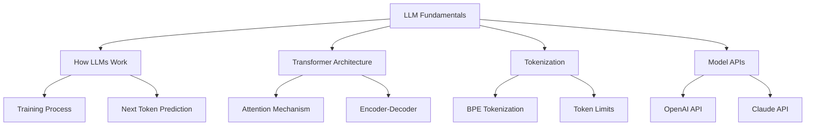

import ChapterActions from '@site/src/components/ChapterActions';

# Chapter 2: LLM Fundamentals

<ChapterActions chapterId="chapter-2" />

## Learning Objectives

By the end of this chapter, you will be able to:

:::info Objectives
1. **Explain** how Large Language Models (LLMs) work at a high level
2. **Understand** the Transformer architecture and attention mechanisms
3. **Describe** tokenization and how text is processed by LLMs
4. **Implement** basic LLM API calls using Python
5. **Compare** different LLM providers and models
:::

## Why This Chapter Matters

Large Language Models are the foundation of modern AI assistants, chatbots, and content generation tools. Understanding how they work enables you to:

- Use LLMs more effectively
- Debug issues with AI-generated content
- Make informed decisions about model selection
- Build better AI-powered applications

## Chapter Overview

---

Ready to dive in? Start with [Core Concepts](/book/chapter-2/concepts).
